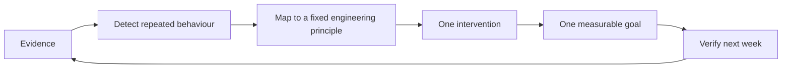

# Forge

Forge is an evidence-backed engineering memory and coaching layer for a single developer. It ingests Git history, pull-request feedback, agent-provided conversation evidence, and error observations; extracts cited decisions; verifies them against later work; and turns repeated, measurable behaviour into one focused improvement goal.

Forge is not a generic RAG store and does not infer a personality. Every decision, pattern, and recommendation must link to source evidence. When the evidence is thin, Forge says so.

## Status

This repository currently contains the product and technical specification. The application has not yet been scaffolded, so the installation commands below are the **delivery contract** for the first implementation phase, not commands that work today.

## Core loop



Examples of evidence are Git commits, PR reviews, agent conversations, and error logs. Initial observable patterns include repeated large commits, repeated review themes, and unverified hotfixes. The corresponding principles include incremental development, feedback-driven development, and hypothesis-driven debugging.

## Planned open-source quick start

The first implementation must make this path work without code changes:

```bash
git clone https://github.com/<owner>/forge.git
cd forge
cp .env.example .env
pnpm install
pnpm supabase:push
pnpm dev
```

In another terminal:

```bash
pnpm worker
```

Then open `http://localhost:3000`, configure a GitHub webhook, and review the first pending decision. A Docker alternative will be provided through `docker compose up --build`.

The initial release targets a single user and has no login flow. GitHub webhook signatures and server-side Supabase credentials remain mandatory protections.

## Documentation

- [Product requirements](docs/PRD.md)
- [Technical requirements](docs/TRD.md)
- [Architecture](docs/ARCHITECTURE.md)
- [System design](docs/SYSTEM-DESIGN.md)
- [API and MCP specification](docs/API-MCP-SPEC.md)
- [Data model](docs/DATA-MODEL.md)
- [Backend schema](docs/BACKEND-SCHEMA.md)
- [Ingestion pipeline](docs/INGESTION-PIPELINE.md)
- [Extraction, verification, and coaching pipeline](docs/EXTRACTION-VERIFICATION-COACHING.md)
- [Open-source setup and distribution](docs/OPEN-SOURCE-SETUP.md)
- [Implementation plan](docs/IMPLEMENTATION-PLAN.md)

## Design principles

1. Evidence before interpretation.
2. A pending decision never becomes project memory automatically.
3. Absence of evidence is not verification.
4. One observation is a data point, not Builder DNA.
5. One active coaching goal is better than a list of nags.
