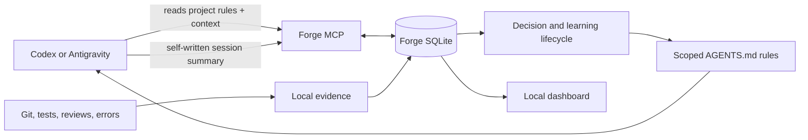

# Forge

Forge is a local shared-memory system for coding agents. Codex and Antigravity summarise **their own** completed sessions, send short structured facts to Forge through MCP, and retrieve the same project context before later work.

Forge is not a chat archive and does not silently read agent transcripts. Git, GitHub review data, test results, and agent-supplied summaries are evidence; Forge keeps the evidence local and makes the next agent's context traceable.

## New Forge: target architecture

Forge v1 is moving from a review-only engineering notebook to an evidence-first learning loop. Each workspace chooses its rule policy once:

- **Approval mode** — Forge proposes a rule change; a developer approves it before it becomes active.
- **Autonomous mode** — Forge activates only evidence-backed, scoped rules automatically, retains every version, and can roll back a rule when later evidence contradicts it.

The choice is local to the workspace, visible in the dashboard, and can be changed deliberately. Autonomous mode does **not** mean unrestricted self-editing: Forge must never auto-merge, resolve conflicts, modify unrelated files, store raw transcripts, or create rules from an unsupported claim.



Read the full design in [the new architecture](docs/ARCHITECTURE.md) and [the seven-stage learning loop](docs/INGESTION-PIPELINE.md).

## What works today

The current code runs locally: SQLite, local Git ingestion, optional GitHub PR/review polling, a loopback dashboard/API, and an MCP server for Codex and Antigravity. It can persist cited session handoffs and pending/confirmed decisions. GitHub polling is opt-in, paginated, bounded, idempotent, and retains only safe local telemetry.

The autonomous rule lifecycle, one-time policy selection, automatic rule projection, and richer failure-learning loop are the documented **v1 target**, not yet fully implemented in the current MCP/API schema. See [the implementation plan](docs/IMPLEMENTATION-PLAN.md) for the migration order.

## Install and run the current local core

```powershell
pip install -e .
pnpm --dir frontend build
forge start --path .
```

Open `http://127.0.0.1:8000`. Forge stores its database at `.forge/forge.sqlite3` in the selected repository.

Connect the same database to Codex or Antigravity using [agent setup](docs/AGENT-SETUP.md). The agent reads the repository instructions, retrieves Forge context, and submits its own structured end-of-session summary; Forge never extracts or uploads the raw conversation.

## GPT-5.6 and Codex

Forge contains no LangChain, LlamaIndex, OpenAI API, or GPT-5.6 integration. If Codex is configured to use GPT-5.6, the model is the agent that writes the structured session summary and calls MCP; Forge treats it like any other agent and stores only the submitted summary and cited local evidence. See [model runtime boundaries](docs/MODEL-RUNTIME.md).

## Safety rules

1. The local SQLite database is the source of truth; raw chat transcripts are never imported.
2. Every learning links to concrete local evidence and includes a scope, outcome, and version history.
3. A rule only applies to matching work; unsupported or contradicted rules are quarantined or rolled back.
4. Forge never auto-merges, resolves conflicts, changes GitHub data, or exposes credentials.
5. GitHub failure never prevents local Git, MCP, or the dashboard from working.

## Documentation

- [Product requirements](docs/PRD.md)
- [Architecture and diagram](docs/ARCHITECTURE.md)
- [Seven-stage learning pipeline](docs/INGESTION-PIPELINE.md)
- [MCP and API contract](docs/API-MCP-SPEC.md)
- [Data model](docs/DATA-MODEL.md)
- [Codex and Antigravity setup](docs/AGENT-SETUP.md)
- [Model runtime boundaries](docs/MODEL-RUNTIME.md)
- [Implementation plan](docs/IMPLEMENTATION-PLAN.md)
- [Local setup](docs/OPEN-SOURCE-SETUP.md)
