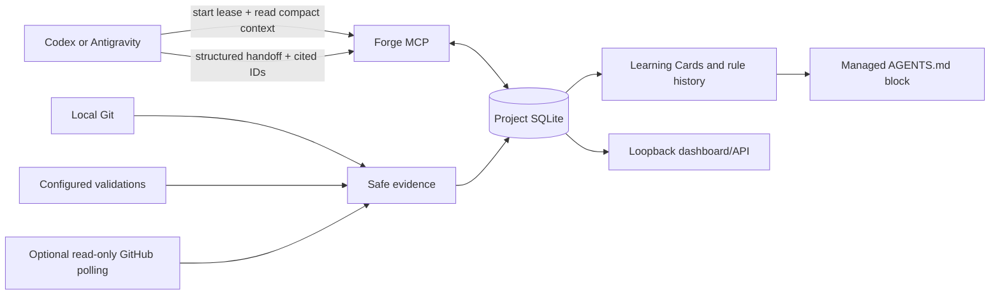

# Forge

Forge is local-first project memory for coding agents. It lets Codex and Antigravity leave a compact, evidence-backed handoff for the next agent without turning developer chats into an archive.

Forge stores local facts: Session Handoffs, decisions, configured validation results, Learning Cards, scoped rules, Git/GitHub evidence, and safe runtime telemetry. SQLite is the source of truth; the dashboard and MCP tools are local views of that data.

## What Forge does

- Starts one local Forge session per active agent and repository.
- Gives the agent compact context: active project rules, approved reusable rules, decisions, alerts, and the latest handoff.
- Saves a structured handoff at `/forge_end`: what changed, why, what failed before, alternatives, validation, risks, and unresolved work.
- Creates evidence-gated Learning Cards and scoped `AGENTS.md` rules. A rule needs two independent, trusted configured-validation-backed handoffs before it can be activated.
- Keeps rule activation reversible. Contradictory evidence retracts the rule and rolls back Forge's managed `AGENTS.md` block.
- Optionally imports GitHub pull requests, reviews, and inline review comments using local-only, bounded, restart-safe polling.

Forge is not a chat archive, cloud service, autonomous coding agent, GitHub writer, or merge bot.

## Architecture



Read the detailed [architecture](docs/ARCHITECTURE.md), [learning lifecycle](docs/INGESTION-PIPELINE.md), and [data model](docs/DATA-MODEL.md).

## Install

The PyPI distribution is named `forge-local-memory`; it installs the `forge` command. Until the first PyPI tag is published, install from GitHub instead.

```powershell
# Current source release
pipx install "git+https://github.com/jeel1566/Forge.git@main"

# After PyPI publication
# pipx install forge-local-memory

# Install Forge for one agent only
forge install codex
# or, inside a repository with an Antigravity dashboard sidecar:
forge install antigravity --path .
```

Then restart the chosen agent. The full walkthrough, repair steps, upgrades, GitHub polling, dashboard ownership, and optional ChatGPT connector are in [Installation](docs/INSTALLATION.md).

## Daily agent loop

1. The installed agent instruction runs `forge session-start --path . --agent <agent>`.
2. The agent calls `forge_get_session_start_context` and works normally.
3. When the developer types `/forge_end`, the installed Forge End skill runs configured checks, records one transcript-free handoff, reports alerts, and releases that exact lease.
4. The next agent reads the persisted handoff and relevant rules through MCP.

The dashboard is optional. MCP and SQLite continue to work when no dashboard server is running.

## GPT-5.6, Codex, and the “brain” boundary

Forge has no OpenAI API key, model SDK, LangChain, LlamaIndex, or internal LLM. It does not choose a model, read conversations, summarise chats, or train on the project.

If Codex is configured to use GPT-5.6, GPT-5.6 is the reasoning agent: it reads repository instructions, retrieves Forge context, makes code changes, runs checks, and writes its own clean handoff. Antigravity follows the same pattern with its own configured model. Forge is the durable memory and evidence gate, not the brain.

This repository cannot prove or measure prior GPT-5.6 chat performance because Forge deliberately does not store raw chats. See [Model runtime boundaries](docs/MODEL-RUNTIME.md).

### How Codex helped build Forge

This is a development-provenance summary from the visible project work and Git history, not a Forge chat export. Codex was used as the coding collaborator to audit the repository, turn the Forge idea into implementation slices, change the Python/SQLite/MCP code, build the agent install and session lifecycle, harden GitHub polling, repair dashboard/runtime issues, add the learning and vault flows, run tests/builds, prepare the `pipx` package, and keep the documentation aligned with the shipped code.

Codex did not become a hidden Forge service. During future use, Codex (and GPT-5.6 when selected by Codex) remains the agent that reasons about a task and writes a clean handoff; Forge remains the local memory, evidence gate, and rule lifecycle system.

## Release status

- **GitHub source:** published on `main`.
- **Package metadata:** prepared as `forge-local-memory`, version `0.1.0`.
- **PyPI release:** **not published yet**.
- **Git release tag:** **not created yet**.

Until the first tagged PyPI release, install the current source with:

```powershell
pipx install "git+https://github.com/jeel1566/Forge.git@main"
```

To publish, configure the PyPI Trusted Publisher, create the protected GitHub `pypi` environment, then push the matching `v0.1.0` tag. The release workflow will build, validate, and publish without storing a PyPI token. See [Releasing Forge](docs/RELEASING.md).

## Safety rules

1. Never store raw chat transcripts, tokens, authorization headers, raw command output, or raw GitHub response bodies.
2. Never auto-merge, resolve conflicts, write GitHub data, or alter files outside Forge's managed `AGENTS.md` block.
3. Only checked-in `forge.validation.json` commands run as trusted validation. Arbitrary commands remain untrusted context.
4. Developer review decides duplicate/conflict handling, approval-mode activation, reusable-rule promotion, and non-validation verification inputs.
5. GitHub polling is opt-in and failure-tolerant. Offline GitHub never blocks local Git, MCP, SQLite, or the dashboard.
6. ChatGPT transport is loopback-only and read-only; Codex and Antigravity handle reviewed write workflows.

## Documentation

- [Architecture](docs/ARCHITECTURE.md)
- [Installation and operations](docs/INSTALLATION.md)
- [Agent lifecycle](docs/AGENT-LIFECYCLE-DESIGN.md)
- [MCP and HTTP API reference](docs/API-MCP-SPEC.md)
- [Data model and retention](docs/DATA-MODEL.md)
- [Learning pipeline](docs/INGESTION-PIPELINE.md)
- [Model runtime boundaries](docs/MODEL-RUNTIME.md)
- [Validation configuration](docs/STRUCTURED-TEMPLATES.md)
- [Release process](docs/RELEASING.md)
- [Documentation map](docs/DOCUMENTATION.md)
