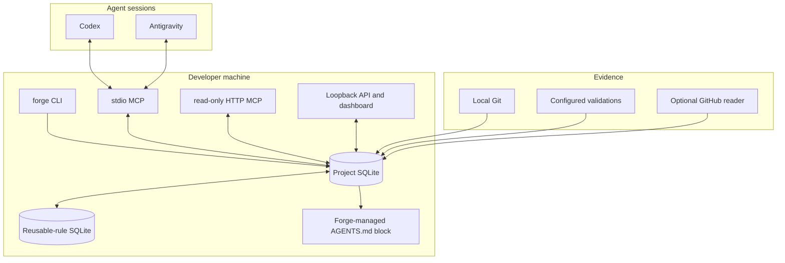
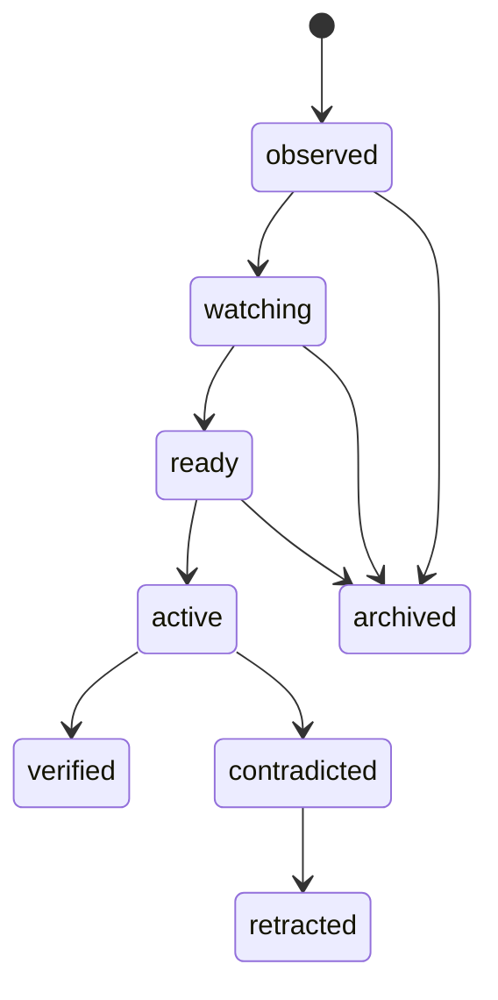

# Forge architecture

## Purpose

Forge is a local evidence and memory layer used by coding agents. Agents do the reasoning; Forge persists only the compact facts they explicitly submit and connects those facts to local proof.

Every repository keeps a project database at `.forge/forge.sqlite3`. Reusable rules live in a separate local registry at `~/.forge/reusable-rules.sqlite3` unless `FORGE_REUSABLE_RULES_DB` overrides it.

## Components

## Data flow

1. `forge session-start` resolves the repository root, initializes or reuses project SQLite, registers a lease, and returns a session ID.
2. The agent reads `forge_get_session_start_context`; Forge returns persisted facts only.
3. The agent may create work items, cited handoffs, decisions, validation evidence, and verification inputs through the local stdio MCP server.
4. Forge normalizes a proposed rule's scope, area, trigger, and action into a Learning Card. Exact identity reuses the card; close identities generate duplicate/conflict alerts.
5. Two independent handoffs with applicable trusted configured validations make a card `ready`. Pending duplicate/conflict alerts block activation.
6. Approval mode requires the developer to approve the exact managed-block diff. Autonomous mode can activate only a ready, unflagged card. Both use a durable projection journal and atomic file replacement.
7. Later support verifies a card. A confirmed contradiction retracts its active rule and regenerates the managed block without it.

## Lifecycle

`review_due_at` is 90 days after activation. An overdue active rule stays active; Forge emits a review alert rather than removing it automatically.

## Runtime ownership

- **Codex:** its persistent Forge MCP process owns any dashboard started by `forge_start_dashboard`.
- **Antigravity:** an optional repository sidecar owns the dashboard process and can restart it on failure.
- **Sessions:** one project may have Codex and Antigravity leases at the same time. Forge stops managed runtime only after the final lease ends and cleans stale crashed leases safely.
- **ChatGPT:** `forge mcp-http` is a separate loopback-only, read-only server. A separately installed OpenAI tunnel client is optional and never required for Codex or Antigravity.

## Failure boundaries

The local product remains usable if GitHub, the network, the dashboard, or the optional tunnel is unavailable. GitHub sync records safe status and retry telemetry; it never blocks local memory operations. Forge never overwrites a manually edited managed rule block: it creates a projection-repair alert instead.
