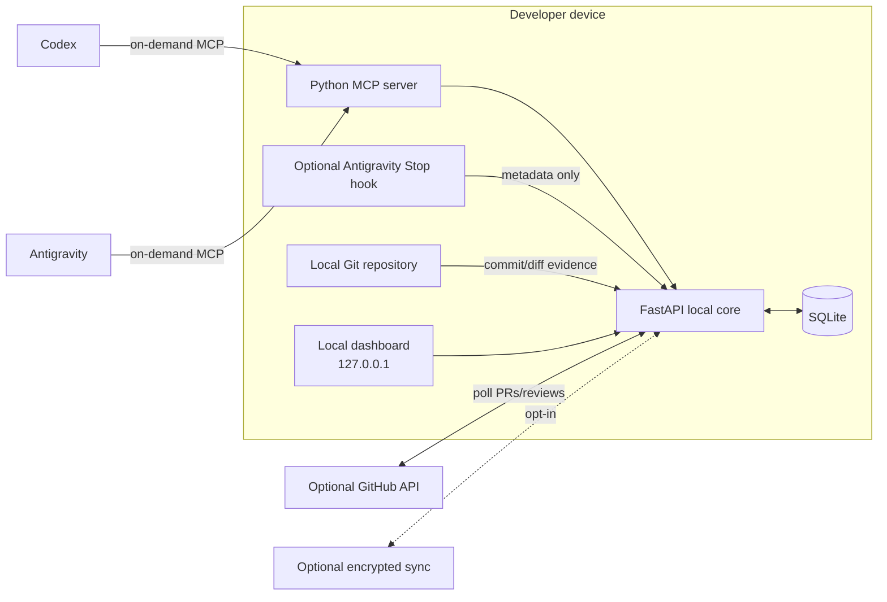
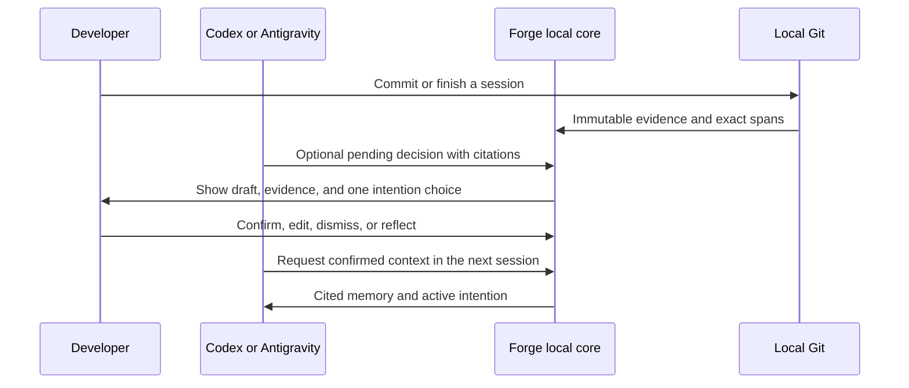
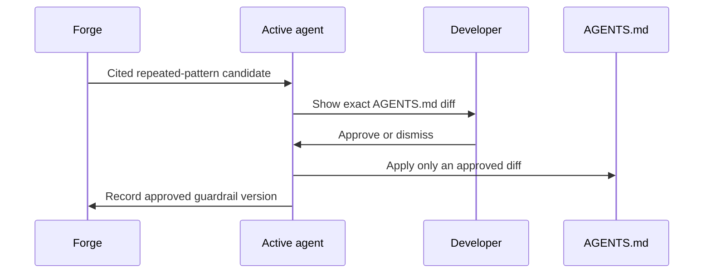

# Local-first architecture

## Runtime topology



Forge has one always-on component only while the developer chooses to run it: the local core. `forge start` serves the web app and API on loopback, owns the SQLite database, and performs local Git ingestion. The MCP server is started by the coding agent only when that agent is active.

GitHub webhooks are not part of the default product because GitHub cannot contact a normal loopback server. Forge can poll GitHub when the local core is running. A hosted relay is a future opt-in integration, never a required account.

## The memory loop



The agent may propose; the developer decides. An agent does not get permission to confirm memory, and Forge does not automatically import chat transcripts.

## AGENTS.md guardrail handoff



Forge never edits AGENTS.md directly. It supplies cited, confirmed guardrail candidates to the active agent; the agent presents a human-readable diff, and the developer authorizes the change. When a project has no AGENTS.md, the agent can offer individually approved portable guardrails from Forge. Project-specific instructions, commands, and architecture rules are never copied automatically from another repository.

## Component responsibilities

| Component | Owns | Does not own |
|---|---|---|
| Local core | HTTP API, SQLite writes, Git ingestion, dashboard reads. | Agent reasoning or external network access without opt-in. |
| SQLite | Evidence, spans, pending decisions, confirmed memory, intentions, and connector state. | Raw chat transcripts by default. |
| MCP server | Cited reads and pending writes for an active agent. | Silent session history access or memory confirmation. |
| Agent integration | Context-aware suggestion and explicit MCP invocation. | Direct database access. |
| AGENTS.md handoff | Cited guardrail candidates and approved rule history. | Silent file writes or cross-project copying. |
| GitHub connector | Optional PR/review polling. | Required local commits or product availability. |
| Optional sync | Encrypted backup/multi-device portability. | Core operation. |

## States and failure behavior

| Condition | Forge behavior | User-visible result |
|---|---|---|
| Forge is stopped | MCP is unavailable; local Git is not watched. | Agent says Forge is offline. No data is lost. |
| Agent is closed | Local core and dashboard continue normally. | Existing memory remains available in the dashboard. |
| GitHub is unavailable | Local Git evidence still works. | Connector shows stale/offline status. |
| No useful evidence exists | Forge produces no advice. | `Insufficient evidence` with an explanation. |
| A draft is rejected | Evidence remains immutable; memory is unchanged. | Rejection is visible in history. |
| Optional sync is disabled | Local core remains fully functional. | No cloud account or network dependency. |

## Security and privacy boundaries

- Bind the web server to `127.0.0.1` only.
- Keep the database and exports on the developer's device by default.
- Use GitHub fine-grained, read-only tokens only when the connector is enabled.
- Require explicit consent before storing any agent-supplied reflection; never read raw transcripts by default.
- Confirmed memory is a user action, never an agent side effect.

## Distribution path

The primary distribution is a Python package:

```bash
pipx install forge-memory
forge start
forge connect codex
forge connect antigravity
```

Docker is optional for contributors, not a requirement for everyday users. Start-at-login and cloud sync are future opt-in features after the local loop is proven useful.
