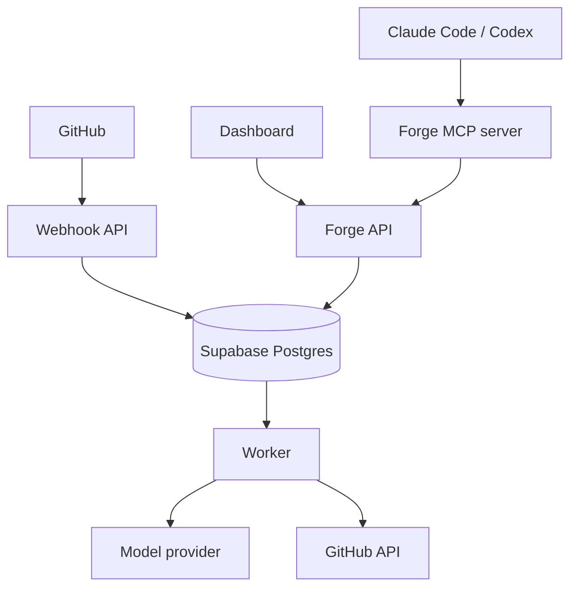

# Architecture

## Components

## Boundaries

- **Webhook API:** validates GitHub signatures, deduplicates deliveries, persists a job, and returns.
- **Forge API:** is the only path for the dashboard and MCP server to read or write product state.
- **MCP server:** provides compact cited context and pending-only writes; it cannot directly update project memory.
- **Worker:** normalizes evidence, calls model adapters, performs deterministic metric calculations, and advances jobs.
- **Supabase PostgreSQL:** is the immutable evidence ledger and system of record.

## Trust model

Evidence is immutable. Interpretations are mutable but versioned. Current project memory is a projection of confirmed decisions. Patterns are statements about repeated observable behaviour, and coaching is downstream of qualifying patterns only.

## Deliberate omissions

The MVP contains no vector database, event bus, Redis, or multi-tenant authentication. These can be justified later only if measured needs exceed Postgres and a single worker.
