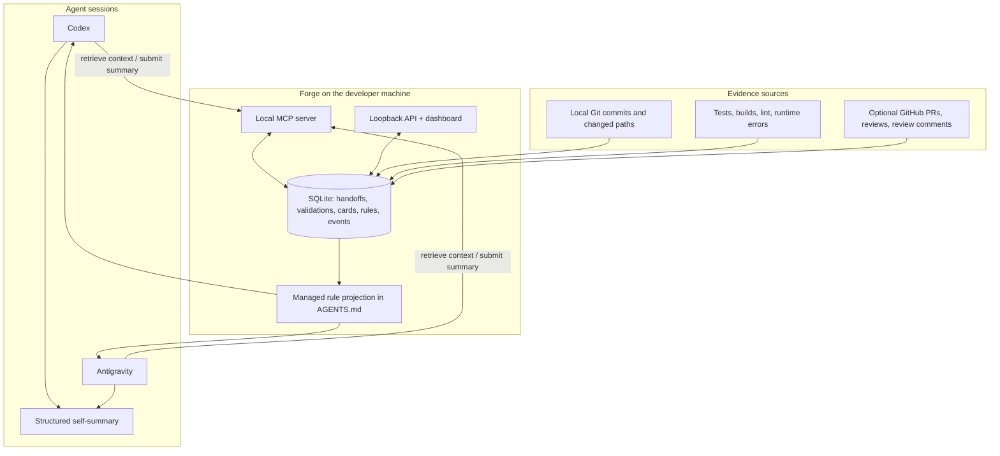
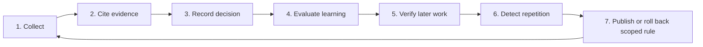

# Forge architecture

## Purpose

Forge is a local, shared memory for coding agents. Codex and Antigravity do their own reasoning and summarise their own sessions. Forge stores that compact summary alongside local evidence, returns relevant context to the next agent, and maintains scoped rules for the repository.

Forge never reads an agent's transcript. MCP is the explicit bridge: an agent chooses what structured facts to send and Forge returns only persisted local metadata.

## Whole-system diagram

## The seven stages

1. **Collect** — an agent submits its own summary; Git, tests, errors, and optional GitHub data provide local facts.
2. **Cite evidence** — Forge links the summary to exact commits, changed paths, test results, or review records.
3. **Record handoff** — Forge records what changed, why it was chosen, alternatives removed, failure of the old approach, and validation.
4. **Evaluate learning** — a Learning Card is checked for structured identity, configured validation coverage, duplication, and policy mode.
5. **Verify later work** — later results support, contradict, or leave the rule unverified; silence proves nothing.
6. **Detect repetition** — repeated, separately cited failures can strengthen a candidate rule.
7. **Publish or roll back** — approval mode waits for confirmation; autonomous mode may project a safe rule and records a reversible version.

## Policy boundary

On first workspace initialization, Forge asks once whether rules run in `approval` or `autonomous` mode. The selection is persisted per workspace.

| Mode | Rule transition | Required safeguard |
|---|---|---|
| Approval | Ready Learning Card → developer approval → active | Exact rule diff and cited configured validation evidence are shown. |
| Autonomous | Ready Learning Card → active | Scope, provenance, version, review date, and rollback journal are mandatory. |

Both modes prohibit raw transcript capture, secrets in memory, auto-merges, conflict resolution, GitHub writes, and rules without evidence.

## Current implementation versus target

Forge provides local Git/GitHub evidence, SQLite persistence, work-session boundaries, cited Session Handoffs, configured local validation, Learning Cards, and managed-rule rollback. Legacy session-context and guardrail paths are retained as read-only history only; new agents use the focused Session Handoff and Learning Card MCP tools.

## Runtime and failure behavior

The API binds to `127.0.0.1`; the MCP process uses local stdio and opens the same SQLite database. Optional GitHub polling runs only while Forge runs, is disabled by default, and never blocks local features. Safe telemetry records request/status/rate-limit/retry information but never tokens, headers, or raw response bodies.

If Forge is offline, agents continue normally and state that shared context is unavailable. If GitHub is offline or rate limited, local Git evidence, MCP, and the dashboard remain usable.
