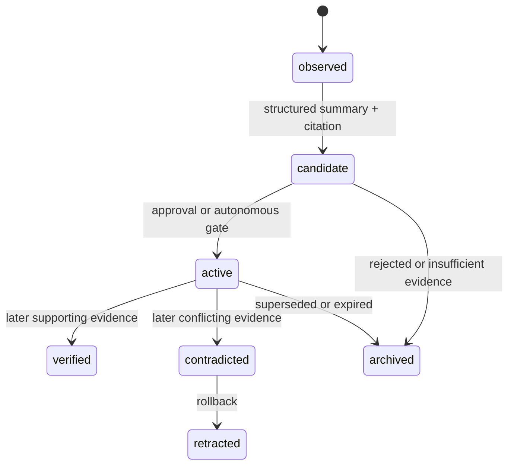

# System design

## Canonical record

SQLite is Forge's canonical memory. `AGENTS.md` is a generated, human-readable projection of active scoped rules, not the source of truth. Each rule version links back to a decision, session summary, and immutable evidence.

## Learning state machine

## Invariants

1. Forge stores no raw chat transcript; agents submit their own short structured summaries.
2. Every rule version has scope, provenance, evidence IDs, activation mode, and state history.
3. Approval mode never activates a rule before explicit approval of its exact projection.
4. Autonomous mode never activates a rule without a deterministic evidence threshold, a rollback record, and a review/expiry time.
5. Later silence is `insufficient_data`, never confirmation.
6. Rules cannot grant permission to merge, resolve conflicts, expose secrets, or write GitHub data.
7. Local functionality remains available when GitHub or the network is unavailable.

## Evidence quality

Strong evidence is a failed/passing verification command, Git change, reviewed PR comment, reproducible error, revert, or explicitly linked external record. Agent prose explains context but cannot alone raise a rule to active status.

## Retention

Keep active rules and their provenance until superseded or archived. Retain sync diagnostics for a bounded local window (currently 30 days and 500 events). Never retain tokens, authorization headers, or raw sensitive GitHub responses.
